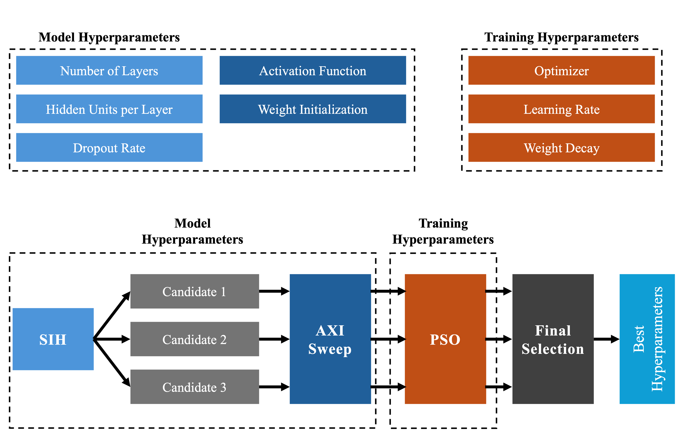
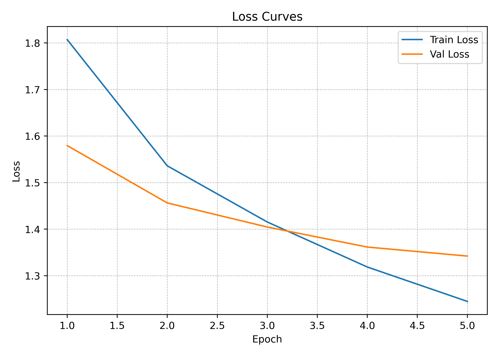
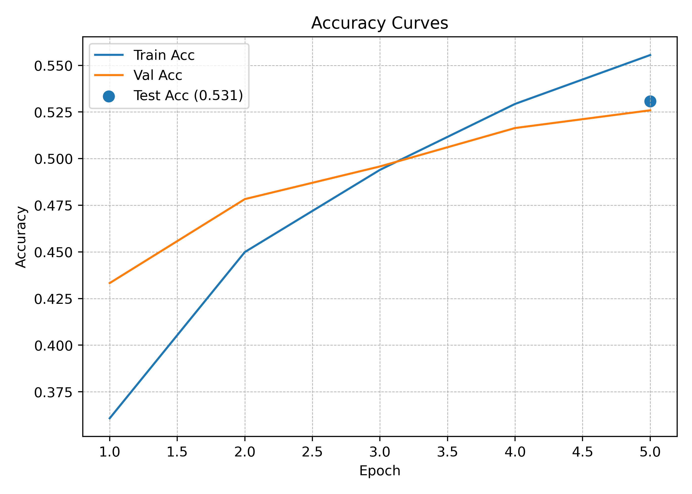
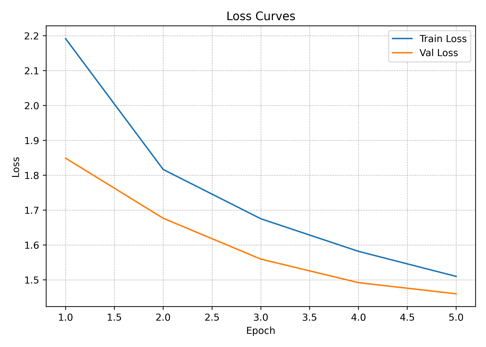
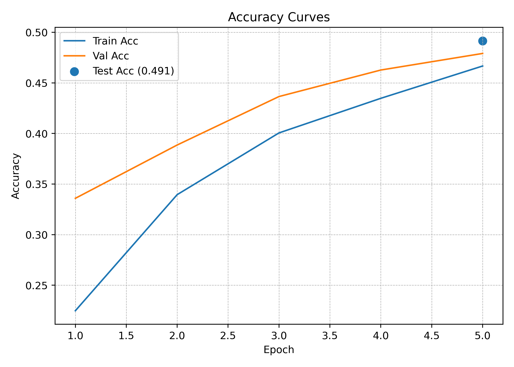
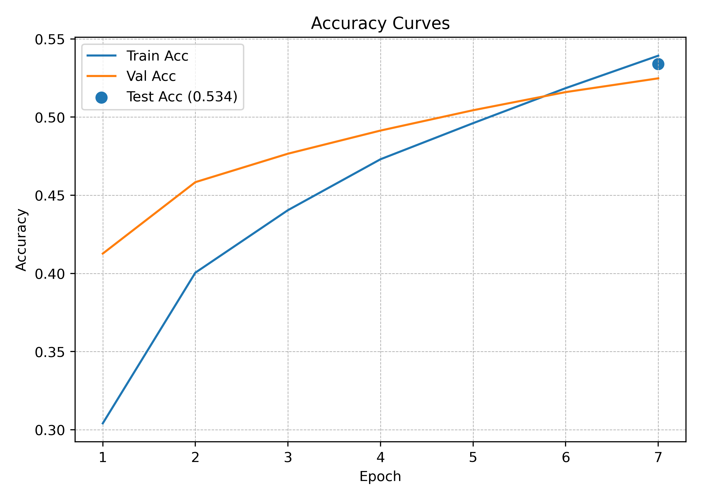
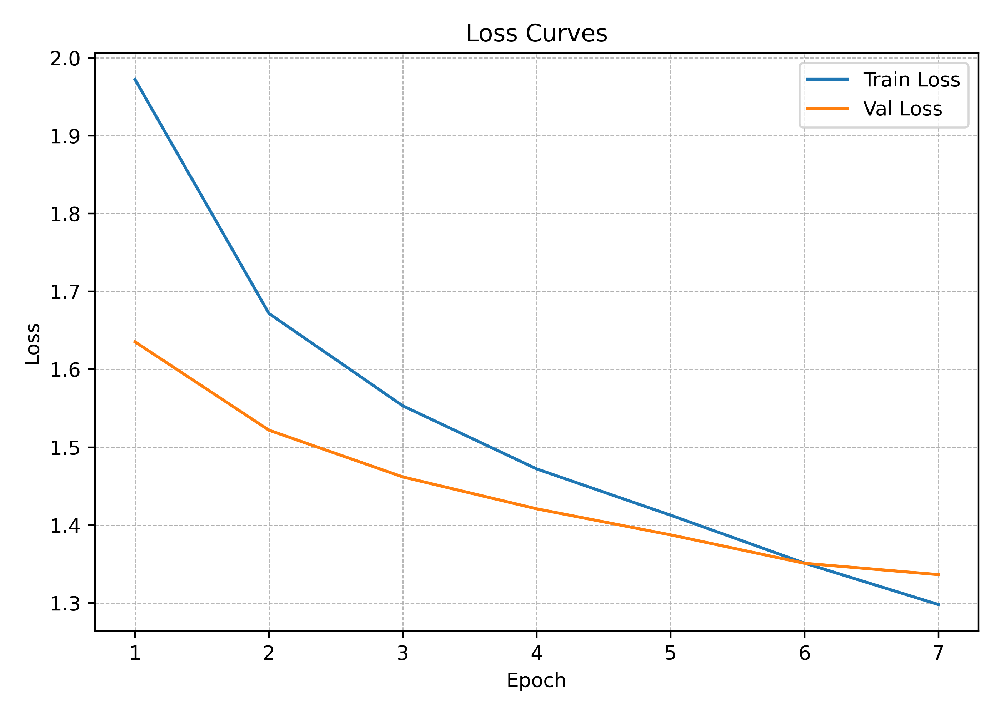

<h1 align="center" style="margin: 0; padding: 0;">
  CIFAR-10 다중 클래스 분류를 위한 MLP 모델의<br/>
  하이퍼파라미터 최적화 알고리즘
</h1>

## final 파일설명
해딩 실험을 통해 나온 시각화(.png, .svg), 로그(.txt)
시각화 파일 이나 로그 파일 이름을 보면 신뢰구간에 대해서 표시 되어있다.
해당 시각화 파일에서는 정량적인 정확도나 로스를 확인하지 못하지만 로그 파일의 마지막 부분들을 보면 확인 할 수 있다.

## 실행
```
python auto.py
```

## 파이프라인
<p align="center">  </p>

## 결과
### 신뢰도 75%
<table>
<tr>
  <th>Run #1 (2025-11-03 03:57:26)</th>
  <th>Run #2 (2025-11-03 05:55:27)</th>
</tr>
<tr>
  <td align="center">
    
    <br>
    <sub>Loss</sub>&nbsp;&nbsp;&nbsp;&nbsp;<sub>Accuracy</sub>
  </td>
  <td align="center">
    
    <br>
    <sub>Loss</sub>&nbsp;&nbsp;&nbsp;&nbsp;<sub>Accuracy</sub>
  </td>
</tr>
</table>

---

### 신뢰도 85%
<table>
<tr>
  <th>Run #1 (2025-11-03 03:04:19)</th>
  <th>Run #2 (2025-11-03 05:02:49)</th>
</tr>
<tr>
  <td align="center">
    
    <br>
    <sub>Loss</sub>&nbsp;&nbsp;&nbsp;&nbsp;<sub>Accuracy</sub>
  </td>
  <td align="center">
    
    <br>
    <sub>Loss</sub>&nbsp;&nbsp;&nbsp;&nbsp;<sub>Accuracy</sub>
  </td>
</tr>
</table>

---

### 신뢰도 95%
<table>
<tr>
  <th>Run #1 (2025-11-03 02:24:58)</th>
  <th>Run #2 (2025-11-03 04:23:24)</th>
</tr>
<tr>
  <td align="center">
    
    <br>
    <sub>Loss</sub>&nbsp;&nbsp;&nbsp;&nbsp;<sub>Accuracy</sub>
  </td>
  <td align="center">
    
    <br>
    <sub>Loss</sub>&nbsp;&nbsp;&nbsp;&nbsp;<sub>Accuracy</sub>
  </td>
</tr>
</table>
